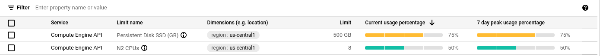

# Running Gitpod in [Google Kubernetes Engine](https://cloud.google.com/kubernetes-engine)

## Provision a GKE cluster

Before starting the installation process, you need:

- A GCP account with Administrator access
  - [Create one now by clicking here](https://console.cloud.google.com/freetrial)
- GCP credentials set up. Install [gcloud](https://cloud.google.com/sdk/docs/install)
- A `.env` file with basic details about the environment.
  - We provide an example of such file [here](.env.example).
- [Docker](https://docs.docker.com/engine/install/) installed on your machine, or better, a Gitpod workspace :)

**To start the installation, execute:**

```shell
make install
```

The whole process takes around twenty minutes. In the end, the following resources are created:

- a GKE cluster running Kubernetes v1.21 ([rapid channel](https://cloud.google.com/kubernetes-engine/docs/release-notes-rapid)).
- GCP L4 load balancer.
- Cloud SQL - Mysql database.
- Cloud DNS zone.
- In-cluster docker registry using [Cloud Storage](https://cloud.google.com/storage) as storage backend.
- [calico](https://docs.projectcalico.org) as CNI and NetworkPolicy implementation.
- [cert-manager](https://cert-manager.io/) for self-signed SSL certificates.
- [Jaeger operator](https://github.com/jaegertracing/helm-charts/tree/main/charts/jaeger-operator) - and Jaeger deployment for gitpod distributed tracing.
- [gitpod.io](https://github.com/gitpod-io/gitpod) deployment.

### Common errors running make install

- Insufficient regional quota to satisfy request

  Depending on the size of the configured `disks size` and `machine-type`,
  it may be necessary to request an [increase in the service quota](https://console.cloud.google.com/iam-admin/quotas?usage=USED)

  [](https://console.cloud.google.com/iam-admin/quotas?usage=USED)

  *After increasing the quota, retry the installation running `make install`*

- Some pods never start (`Init` state)

  ```shell
  ❯ kubectl get pods -l component=proxy
  NAME                     READY   STATUS    RESTARTS   AGE
  proxy-5998488f4c-t8vkh   0/1     Init 0/1  0          5m
  ```
  
  The most likely reason is because the [DNS01 challenge](https://cert-manager.io/docs/configuration/acme/dns01/) has yet to resolve. If using `SETUP_MANAGED_DNS`, you will need to update your DNS records to point to the GCP Cloud DNS nameserver.

  Once the DNS record has been updated, you will need to delete all Cert Manager pods to retrigger the certificate request

  ```shell
  ❯ kubectl delete pods -n cert-manager --all
  ```
  
  After a few minutes, you should see the `https-certificate` become ready.   

  ```shell
  ❯ kubectl get certificate
  NAME                        READY   SECRET                      AGE
  https-certificates          True    https-certificates          5m
  ```

## Verify the installation

First, check that Gitpod components are running.

```shell
kubectl get pods
NAME                                             READY   STATUS      RESTARTS   AGE
agent-smith-bz97r                                2/2     Running     0          95m
agent-smith-dll6b                                2/2     Running     0          95m
agent-smith-kvrs5                                2/2     Running     0          95m
blobserve-74599b4b98-5t9dq                       2/2     Running     0          95m
cloudsqlproxy-cloud-sql-proxy-7556c57c4d-zqptx   1/1     Running     0          95m
cloudsqlproxy-session-ldl9h                      0/1     Completed   0          95m
content-service-758878c6c-b4sqh                  1/1     Running     0          95m
dashboard-758f94ccf5-qk8cm                       1/1     Running     0          95m
image-builder-mk3-55f948b89f-m6qbk               2/2     Running     0          95m
jaeger-operator-6cc9f79cc8-dfkjh                 1/1     Running     0          95m
messagebus-0                                     1/1     Running     0          95m
migrations-5jmkx                                 0/1     Completed   0          95m
openvsx-proxy-0                                  1/1     Running     0          95m
proxy-55665d8765-n2b2w                           2/2     Running     0          95m
registry-facade-4c7tz                            2/2     Running     0          95m
registry-facade-5dxfx                            2/2     Running     0          95m
registry-facade-gxmhv                            2/2     Running     0          95m
server-ccb459f85-8vgfn                           2/2     Running     0          95m
ws-daemon-6qrjf                                  2/2     Running     0          95m
ws-daemon-hslz7                                  2/2     Running     0          95m
ws-daemon-hzw8h                                  2/2     Running     0          95m
ws-manager-8f6bc54f4-r67kk                       1/1     Running     0          95m
ws-manager-bridge-56d7978664-6l6ht               2/2     Running     0          95m
ws-proxy-fbc47486d-kqdvj                         1/1     Running     0          95m
ws-scheduler-5c5d9f998-6zxmz                     2/2     Running     0          95m

```

### Test Gitpod workspaces

When the provisioning and configuration of the cluster is done, the script shows the URL of the load balancer,
like:

```shell
Load balancer IP address: XXX.XXX.XXX.XXX
```

Please open the URL `https://<domain>/workspaces`.
It should display the Gitpod login page similar to the next image.

*DNS propagation* can take several minutes.


----

## Delete Gitpod from your cluster

Remove Gitpod from your cluster running:

```shell
kubectl get configmaps gitpod-app \
  -o jsonpath='{.data.app\.yaml}' | \
  kubectl delete -f -
```

## Destroy the cluster and GCP resources

Remove the GCP cluster running:

```shell
make uninstall
```

> The command asks for a confirmation:
> `Are you sure you want to delete: Gitpod (y/n)?`

> Please make sure you delete the GCP buckets used to store the docker registry images and Cloud SQL database!
