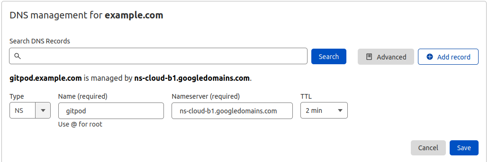

 ## 📣 [IMPORTANT] This repo is being deprecated in favor of the [single cluster reference architecture](https://www.gitpod.io/docs/self-hosted/latest/reference-architecture/single-cluster-ref-arch) and the corresponding [Terraform config](https://github.com/gitpod-io/gitpod/tree/main/install/infra/single-cluster/aws).

**What?** 

We are deprecating this guide in favor of our [reference architectures](https://www.gitpod.io/docs/self-hosted/latest/reference-architecture/single-cluster-ref-arch) (specifically the [single cluster variant](https://www.gitpod.io/docs/self-hosted/latest/reference-architecture/single-cluster-ref-arch)) that include both a guided walk-through and a `Terraform` configuration.

**Why?**

From your feedback, we’ve learned that the guide has several shortcomings:

- It is not obvious what the guide does: it is more a black box than a sensible starting point for creating the infrastructure that works for you.
- One size fits all: it was not flexible enough if you wish to customize the infrastructure being created.
- No incremental upgrades: If a version of a component changes, you’d have to recreate the infrastructure.

Due to the feedback above we’ve decided to move to a more open and industry-standard way of speaking about the recommended infrastructure in the form of our new [reference architectures](https://www.gitpod.io/docs/self-hosted/latest/reference-architecture/single-cluster-ref-arch). These are descriptions of what the ideal infrastructure for Gitpod looks like depending on your circumstances. They include both a text version as well as a Terraform configuration that helps you create this infrastructure automatically - similarly to this guide. We believe these provide the following benefits: 

- They are based on a popular `Infrastructure as Code (IaC)` solution (`Terraform`), which should facilitate maintenance for you (and us) via features such as incremental upgrades.
- They are easier to parse, as they are configuration files rather than a script. This should make customizations easier.
- They provide a detailed walkthrough for those that do not want to use Terraform.
- We already leverage these in our nightly testing to provide further validation and reliability of them when used to run Gitpod.

**Impact?**

Going forward, Gitpod will only officially support the [reference architectures](https://www.gitpod.io/docs/self-hosted/latest/reference-architecture/single-cluster-ref-arch). If you can, we would advise you to switch towards using these - this would require you to recreate your infrastructure using the new Terraform configurations or guide. Staying on infrastructure created by this guide *should* work going forward, however, we cannot guarantee this in perpetuity.

—> The Reference Architectures are still in `beta` or `alpha` while we gather more feedback. Please do reach out to us on Discord or via [support](https://www.gitpod.io/support) with any problems or feedback.

------

## Running Gitpod in [Google Kubernetes Engine](https://cloud.google.com/kubernetes-engine)

> **IMPORTANT** This guide exists as a simple and reliable way of creating an environment in GKE that can run Gitpod. It
> is not designed to cater for every situation. If you find that it does not meet your exact needs,
> please fork this guide and amend it to your own needs.

## Provision a GKE cluster

Before starting the installation process, you need:

- A GCP account with Administrator access
  - [Create one now by clicking here](https://console.cloud.google.com/freetrial)
- GCP credentials set up. Install [gcloud](https://cloud.google.com/sdk/docs/install)
- A `.env` file with basic details about the environment.
  - We provide an example of such file [here](.env.example).
- [Docker](https://docs.docker.com/engine/install/) installed on your machine, or better, a Gitpod workspace :)

**To start the installation, execute:**

```shell
make install
```

The whole process takes around twenty minutes. In the end, the following resources are created. These are the GCP versions of the [components Gitpod requires](https://www.gitpod.io/docs/self-hosted/latest/required-components):

- a GKE cluster running Kubernetes v1.21 ([rapid channel](https://cloud.google.com/kubernetes-engine/docs/release-notes-rapid)).
- GCP L4 load balancer.
- Cloud SQL - Mysql database.
- Cloud DNS zone.
- In-cluster docker registry using [Cloud Storage](https://cloud.google.com/storage) as storage backend.
- [calico](https://docs.projectcalico.org) as CNI and NetworkPolicy implementation.
- [cert-manager](https://cert-manager.io/) for self-signed SSL certificates.

Upon completion, it will print the config for the resources created (including passwords) and create the necessary credential files that will allow you to connect the components created to your Gitpod instance during the [next installation step](https://www.gitpod.io/docs/self-hosted/latest/getting-started#step-4-install-gitpod).  **IMPORTANT** - running the `make install` command after the initial install will change
your database password which will require you to update your KOTS configuration.

## DNS records

> This setup will work even if the parent domain is not owned by a DNS zone in the GCP console.

The recommended setup is to have `SETUP_MANAGED_DNS` be `true` which will create an
[Cloud DNS zone](https://cloud.google.com/dns/docs/zones) for your
domain. When the zone is created, you will see various nameserver records (with type `NS`), such
as `ns-cloud-x1.googledomains.com`, `ns-cloud-x2.googledomains.com`, `ns-cloud-x3.googledomains.com` and `ns-cloud-x4.googledomains.com`
(where `x` is the letter randomly assigned by GCP).

In the DNS manager for the parent domain (eg, `example.com`), create a nameserver record for
each of the nameservers generated by GCP under the subdomain used (eg, `gitpod.example.com`).
This is what it would look like if your parent domain was using Cloudflare.



Once applied, please allow a few minutes for DNS propagation.

### Common errors running make install

- Insufficient regional quota to satisfy request

  Depending on the size of the configured `disks size` and `machine-type`,
  it may be necessary to request an [increase in the service quota](https://console.cloud.google.com/iam-admin/quotas?usage=USED)

  [](https://console.cloud.google.com/iam-admin/quotas?usage=USED)

  *After increasing the quota, retry the installation running `make install`*

- Some pods never start (`Init` state)

  ```shell
  ❯ kubectl get pods -l component=proxy
  NAME                     READY   STATUS    RESTARTS   AGE
  proxy-5998488f4c-t8vkh   0/1     Init 0/1  0          5m
  ```
  
  The most likely reason is that the [DNS01 challenge](https://cert-manager.io/docs/configuration/acme/dns01/) has yet to resolve. If using `SETUP_MANAGED_DNS`, you will need to update your DNS records to point to the GCP Cloud DNS nameserver.

  Once the DNS record has been updated, you will need to delete all cert-manager pods to retrigger the certificate request

  ```shell
  ❯ kubectl delete pods -n cert-manager --all
  ```
  
  After a few minutes, you should see the `https-certificate` become ready.   

  ```shell
  ❯ kubectl get certificate
  NAME                        READY   SECRET                      AGE
  https-certificates          True    https-certificates          5m
  ```

## Destroy the cluster and GCP resources

Remove the GCP cluster running:

```shell
make uninstall
```

> The command asks for a confirmation:
> `Are you sure you want to delete: Gitpod (y/n)?`

> Please make sure you delete the GCP buckets used to store the docker registry images and Cloud SQL database!
